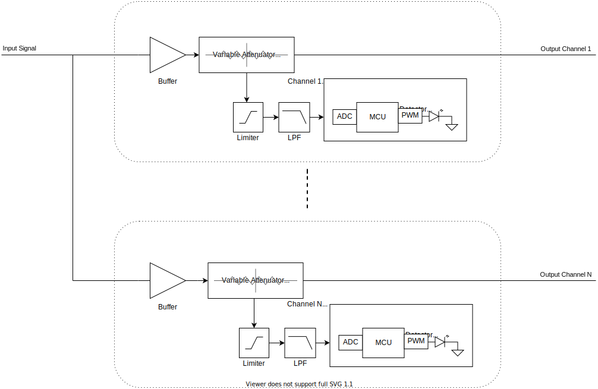
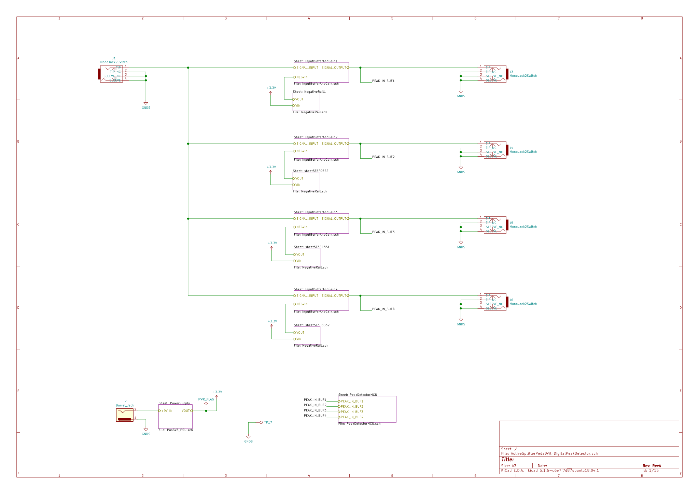
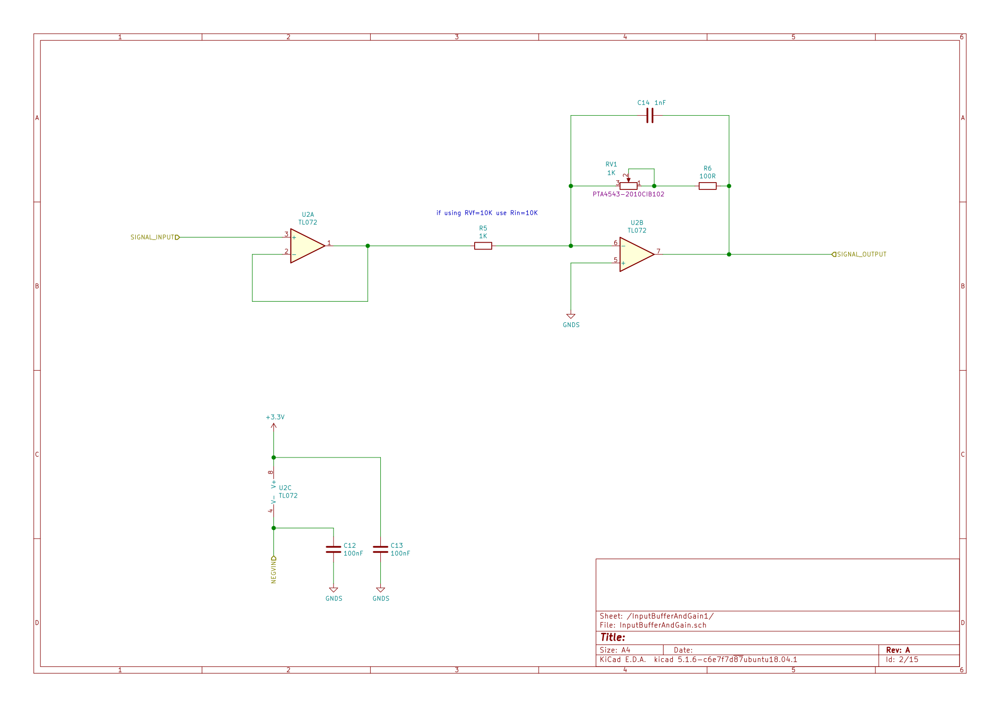
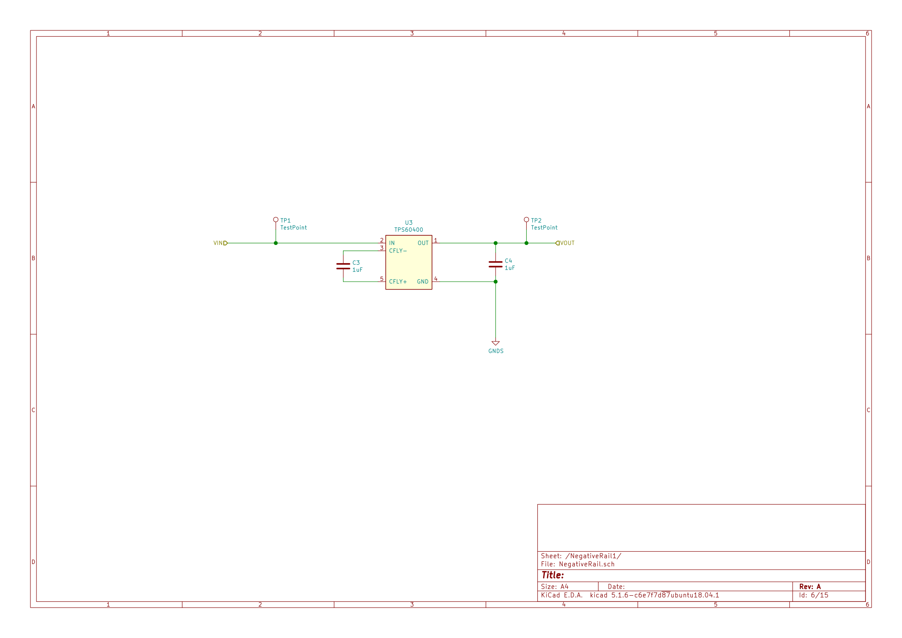
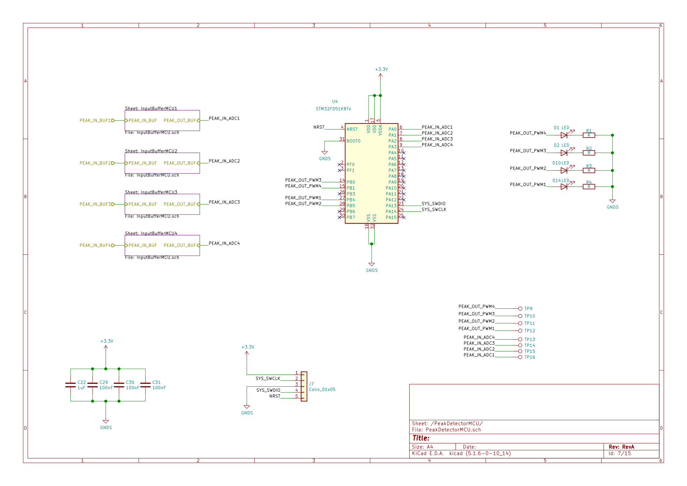
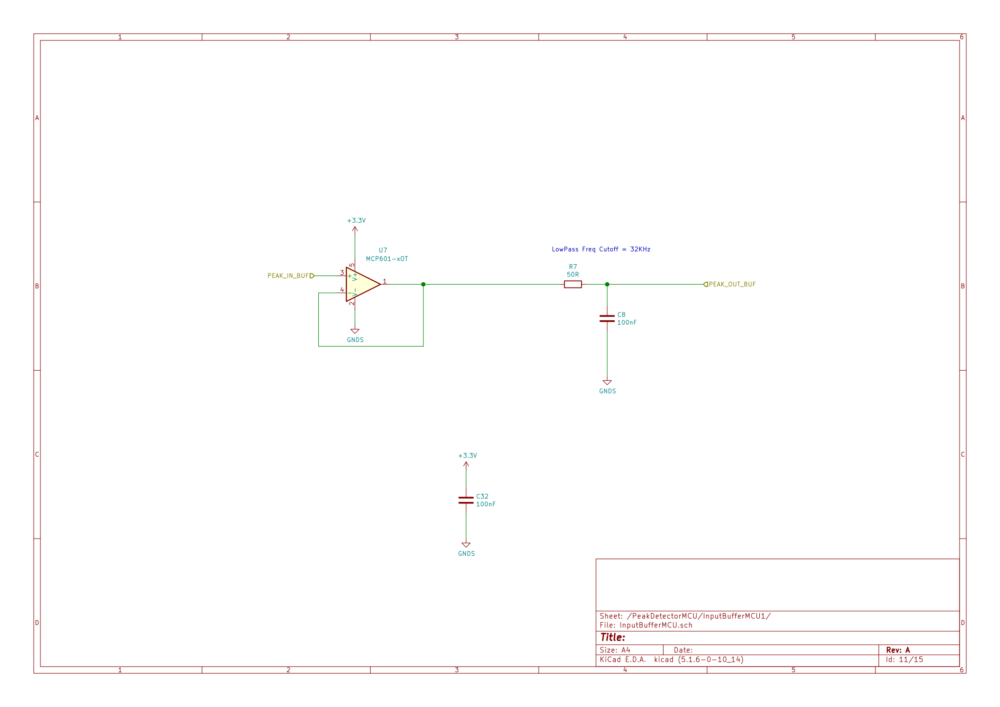
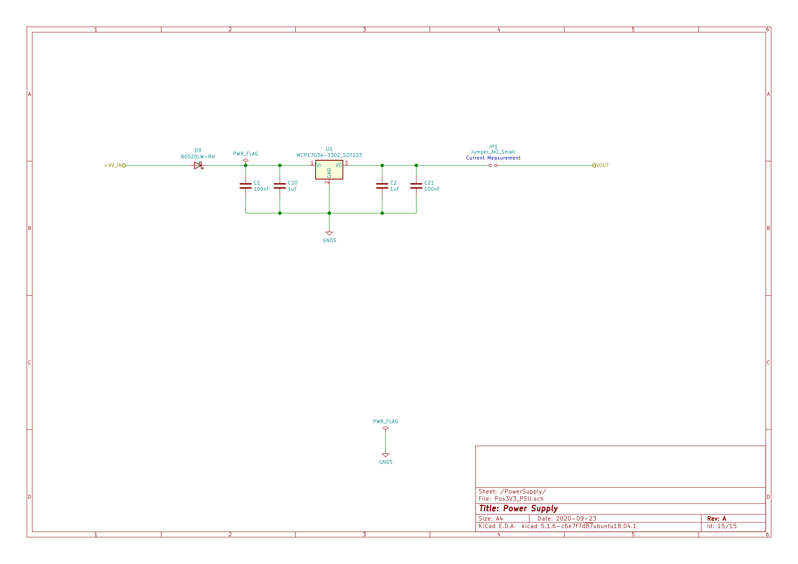
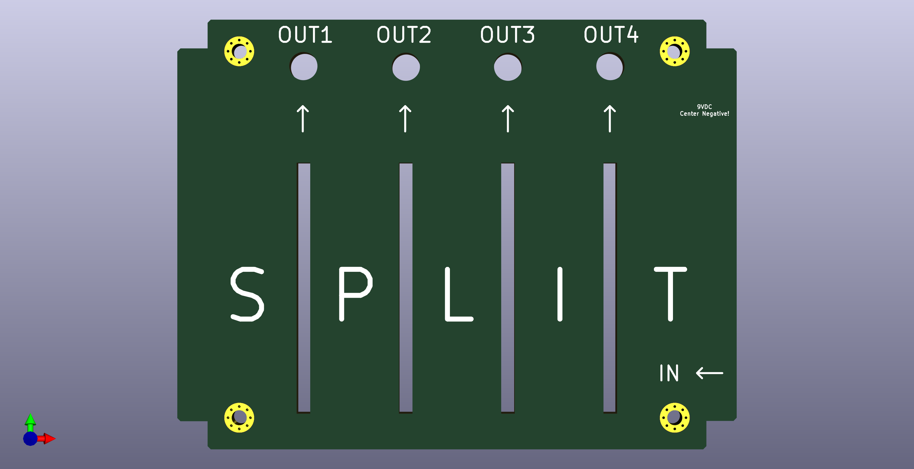

## Active 4-way splitter pedal with digital peak detector

- Analog 1->4 splitter circuit with buffered input and output gain controls.
- Digital LED peak detector per output channel.
- Fits in a Hammond 1590BB enclosure (120mm x 95mm).

Related SW project: https://github.com/cracked-machine/DigitalPeakDetector_SW

### System Overview

### Schematic

##### Top Level

##### Input Buffer and Gain Block

This uses a split supply op amp. The second stage is an inverting op amp configuration so that it can attenuate the input signal down to zero output.
Therefore the second op amp has very low input impedance and will cause "tone-suck" if used on its own. The solution is to add a preceding op amp stage in a non-inverting configuration that works as a high input impedance buffer.

##### Negative Rail Block

Each ``Input Buffer and Gain Block`` requires a split power supply. We use a charge pump to provide a negative voltage rail. The small SOT23-5 package provides ~10mA current, which is enough for a dual opamp in this design.

##### MCU Peak Detector block

This section replaces the classic analog peak detector circuit with a microcontroller. The input signal is captured by the 12bit ADC of the microcontroller. The average input value and the output threshold are determined by software. When the output threshold is reached, the microcontroller briefly toggles the LED. The on/off time duration of the LED is also determined in software.

##### MCU Input Buffer block

This serves several purposes.
1. It acts as a high impedance buffer and low pass filter for the ADC. This helps to provide a cleaner input signal for the ADC by removing high frequency noise.
2. The 3.3V *single* supply of the op amp removes any parts of the input signal that swing above 3.3v and below ground (the limits of the microcontroller). In the event that a line level input signal was plugged into the input, the op amp would be damaged before the microcontroller.

##### Power Supply block

This linear regulator drops the 9VDC input to 3.3VDC. The power requirements of the system components are very low (~65mA) so the expected dissipation is also low (0.37W). A copper pad on both sides of the PCB (with connected vias) is provided to reduce this dissipation.

## 3D Renderings

__PCB__

__Front Panel__

__Back Panel__

This is the same back panel used for
[ActiveMixerPedalWithDigitalPeakDetector_HW ](https://github.com/cracked-machine/ActiveMixerPedalWithDigitalPeakDetector_HW)

__PCB and panel profile__

## TODO

Some issues with the HW design:

- The PSU uses 3.3V for both MCU and Analog blocks. This is too low for the opamps in the analog blocks and does not allow enough headroom for the signal. This can result in clipping of the signal.

- The charge pumps used by the opamps in the analog blocks (used to create a negative voltage rail) need filtering. The negative voltage rail is noisy (observed on the scope) and a high pitched whine can be heard through the output when plugged into a large amplifier. A simple passive LPF would probably solve this. 

- The input is on the wrong side!
